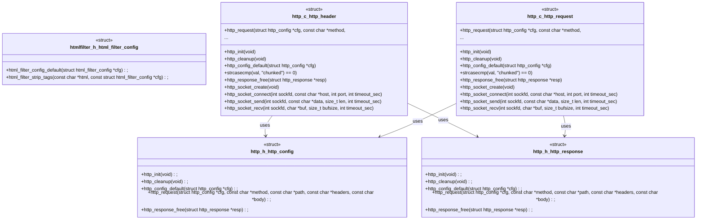

# Polyglot Codebase Knowledge Graph

> Generated offline by **readmenator**. 6 files, 50 symbols, 26 imports. Supports C, C++, Python, Go, Rust, JS/TS, Java, C#, Shell, PHP, Dart, GDScript, Nim, ASM, Ruby, Swift, Kotlin, Scala, Lua, Elixir.
> No LLMs. No tokens. Pure static analysis. See more [here](https://github.com/grisuno/ReadMenator)

**Start here:** Statistics Dashboard for scope, God Nodes for blast radius, Architecture Reference for per-file API. Agents: prefer `readmenator-agent/INDEX.md` + `SYMBOLS.md`.

**Wiki:** prefer `readmenator-wiki/index.md` for progressive disclosure: one synthesis page per community, `connections.json` with EXTRACTED vs INFERRED confidence, `queries.md` log, `REPORT.md` audit.

**Confidence:** EXTRACTED = parsed from source, INFERRED = heuristic bridge, AMBIGUOUS = reported, never hidden. See `readmenator-wiki/REPORT.md`.

**Total Files Parsed:** 6 | **Total Symbols Extracted:** 50 | **Total Imports:** 26
 | **Resolved Imports:** 4

<!-- ranking_model: v1.0 | weights: {ppr:0.45,auth:0.2,test:0.15,doc:0.1,fresh:0.1} | alpha:0.85 | commit:05a4468 | date:2026-07-18 -->


## Table of Contents

1. [Statistics Dashboard](#statistics-dashboard)
2. [Architectural Layers](#architectural-layers)
3. [Ranked Context](#ranked-context)
4. [God Nodes](#god-nodes)
5. [Community Analysis](#community-analysis)
6. [Suggested Questions](#suggested-questions)
7. [Hotspot Analysis](#hotspot-analysis)
8. [Change Impact Analysis](#change-impact-analysis)
9. [Suggested Linting Rules](#suggested-linting-rules)
10. [Dataflow Analysis](#dataflow-analysis)
11. [Orphans](#orphans)
12. [Query Recipes](#query-recipes)
13. [Structural Knowledge Map](#structural-knowledge-map)
14. [UML Class Diagram](#uml-class-diagram)
15. [Code Property Graph](#code-property-graph)
16. [Architecture Reference](#architecture-reference)
    - [C (3 files)](#c-3-files)
    - [H (2 files)](#h-2-files)
    - [PY (1 files)](#py-1-files)

---

## Statistics Dashboard

| Metric | Value |
|--------|-------|
| Total Files | 6 |
| Total Symbols | 50 |
| Total Imports | 26 |
| Call Edges | 0 |
| Inheritance Edges | 0 |
| Languages | 3 |
| Avg Symbols/File | 8.3 |
| Avg Imports/File | 4.3 |
| Resolved Imports | 4 |

### Top Files by Import Count (Fan-Out)

| File | Imports | Symbols | Language |
|------|---------|---------|----------|
| `http.c` | 16 | 33 | c |
| `main.c` | 5 | 1 | c |
| `htmlfilter.c` | 4 | 4 | c |
| `http.h` | 1 | 8 | h |

### Top Files by Imported-By Count (Fan-In)

| File | Imported By | Symbols | Language |
|------|-------------|---------|----------|
| `htmlfilter.h` | 2 | 4 | h |
| `http.h` | 2 | 8 | h |

---

## Architectural Layers

Auto-detected from path patterns, naming conventions, and imported frameworks.

| Layer | Files |
|-------|-------|
| utility | 4 |
| presentation | 2 |

### utility

- `htmlfilter.c` (c, 4 symbols)
- `htmlfilter.h` (h, 4 symbols)
- `main.c` (c, 1 symbols)
- `sniffer.py` (py, 0 symbols)

### presentation

- `http.c` (c, 33 symbols)
- `http.h` (h, 8 symbols)

---

## Ranked Context

Files ranked by composite score for the current query context. The ranking combines Personalized PageRank (query relevance), global authority, test coverage, documentation coverage, and code freshness. Model: v1.0.

| Rank | File | Composite | PPR | Authority | Test | Doc |
|------|------|-----------|-----|-----------|------|-----|
| 1 | `htmlfilter.h` | 0.1959 | 0.3013 | 0.3013 | 0.00 | 0.00 |
| 2 | `http.h` | 0.1959 | 0.3013 | 0.3013 | 0.00 | 0.00 |
| 3 | `http.c` | 0.0891 | 0.1325 | 0.1325 | 0.00 | 0.03 |
| 4 | `htmlfilter.c` | 0.0861 | 0.1325 | 0.1325 | 0.00 | 0.00 |
| 5 | `main.c` | 0.0861 | 0.1325 | 0.1325 | 0.00 | 0.00 |
| 6 | `sniffer.py` | 0.0000 | 0.0000 | 0.0000 | 0.00 | 0.00 |

---

## God Nodes

Most architecturally central files ranked by combined import/export degree and symbol richness.

| File | Score | Connections | PageRank |
|------|-------|-------------|----------|
| `http.c` | 5.3 | | 0.1325 |
| `http.h` | 4.8 | | 0.3013 |
| `htmlfilter.h` | 4.4 | | 0.3013 |
| `main.c` | 4.1 | | 0.1325 |
| `htmlfilter.c` | 2.4 | | 0.1325 |
| `sniffer.py` | 0.0 | | 0.0000 |

---

## Community Analysis

Files grouped by import-based community detection. Cohesion measures how tightly connected each community is internally.

### root (Cohesion: 1.00)

**5 files** in this community:

- `htmlfilter.c` (c, 4 symbols)
- `htmlfilter.h` (h, 4 symbols)
- `http.c` (c, 33 symbols)
- `http.h` (h, 8 symbols)
- `main.c` (c, 1 symbols)

---

## Suggested Questions

Auto-generated exploration prompts based on graph structure:

- What does http.c depend on, and what depends on it? (1 connections)
- What does http.h depend on, and what depends on it? (2 connections)
- What does htmlfilter.h depend on, and what depends on it? (2 connections)
- How are the 5 files in 'root' related to each other?
- What is html_filter_config in htmlfilter.h and how is it used?

---

## Hotspot Analysis

Files ranked by combined complexity (symbol count) and centrality (connection count). High-scoring files are architecturally critical and may need refactoring attention.

| File | Complexity | Centrality | Combined | Symbols | Connections |
|------|-----------|------------|----------|---------|-------------|
| `htmlfilter.h` | 0.121 | 0.235 | 0.190 | 4 | 4 |
| `http.h` | 0.242 | 0.294 | 0.273 | 8 | 5 |
| `http.c` | 1.000 | 1.000 | 1.000 | 33 | 17 |
| `htmlfilter.c` | 0.121 | 0.294 | 0.225 | 4 | 5 |
| `main.c` | 0.030 | 0.412 | 0.259 | 1 | 7 |
| `sniffer.py` | 0.000 | 0.000 | 0.000 | 0 | 0 |

---

## Dataflow Analysis

Procedural intra-function dataflow findings (zero tokens, regex-based heuristics, all INFERRED). Each lead is grounded at file:line for manual review.

**9 findings** (DEAD_STORE: 8, UNCHECKED_ALLOC: 1).

| File | Function | Line | Kind | Variable | Description |
|------|----------|------|------|----------|-------------|
| `http.c` | `http_request` | 135 | `DEAD_STORE` | `redirect_count` | `redirect_count` assigned at line 135 but never read afterwards. |
| `http.c` | `http_request` | 136 | `DEAD_STORE` | `resp` | `resp` assigned at line 136 but never read afterwards. |
| `http.c` | `http_request` | 196 | `DEAD_STORE` | `chunked` | `chunked` assigned at line 196 but never read afterwards. |
| `http.c` | `http_request` | 199 | `DEAD_STORE` | `final_headers` | `final_headers` assigned at line 199 but never read afterwards. |
| `http.c` | `http_request` | 200 | `DEAD_STORE` | `final_headers_len` | `final_headers_len` assigned at line 200 but never read afterwards. |
| `http.c` | `strcasecmp` | 305 | `DEAD_STORE` | `sp2` | `sp2` assigned at line 305 but never read afterwards. |
| `http.c` | `strcasecmp` | 352 | `DEAD_STORE` | `dst` | `dst` assigned at line 352 but never read afterwards. |
| `http.c` | `http_resolve_host` | 510 | `UNCHECKED_ALLOC` | `ip` | Result of allocator stored in `ip` is never checked against NULL. |
| `http.c` | `http_build_request` | 537 | `DEAD_STORE` | `ptr` | `ptr` assigned at line 537 but never read afterwards. |

---

## Change Impact Analysis

Files sorted by how many other files would be affected if they changed. High-impact files should be changed with caution.

| File | Direct Dependents | Transitive Dependents | Total Impact |
|------|------------------|----------------------|--------------|
| `htmlfilter.h` | 2 | 0 | 2 |
| `http.h` | 2 | 0 | 2 |
| `htmlfilter.c` | 0 | 0 | 0 |
| `http.c` | 0 | 0 | 0 |
| `main.c` | 0 | 0 | 0 |
| `sniffer.py` | 0 | 0 | 0 |

---

## Suggested Linting Rules

Automatically suggested linting and security rules based on patterns detected in the codebase. These can be exported as Semgrep rules using the `--export-rules` flag.

| Rule ID | Severity | Description | Language | Matches |
|---------|----------|-------------|----------|---------|
| `RM001` | info | Large number of functions in c: 29 total | c | 29 |
| `RM002` | info | Large number of functions in h: 7 total | h | 7 |
| `RM003` | info | Print statement found (consider logging instead) | python | 12 |

---

## Orphans

Files with no documentation or low connectivity. These are candidates for documentation investment or cleanup.

- `htmlfilter.h` (4 symbols, no doc)
- `http.h` (8 symbols, no doc)
- `htmlfilter.c` (4 symbols, no doc)
- `main.c` (1 symbols, no doc)
- `sniffer.py` (0 symbols, no doc)

---

## Query Recipes

Example queries you can run against this knowledge base using the ranking engine:

```
# Find files most relevant to a concept
readmenator query "Where is the import resolver implemented?"

# Rank files by relevance to a topic
readmenator query "How does documentation generation work?"

# Explain why a file ranks highly
readmenator query "explain readmenator/_documentation.py"

# Trace dependency paths with ranked context
readmenator query "path from CLI to exporter"
```

The ranking model uses the following signals:

- **Personalized PageRank** (45% weight): query-specific relevance via seed propagation
- **Global Authority** (20% weight): structural importance via standard PageRank
- **Test Coverage** (15% weight): fraction of symbols referenced in test files
- **Doc Coverage** (10% weight): presence of docstrings and file-level docs
- **Freshness** (10% weight): recent modification activity

Results include score decomposition and justification paths for each ranked item.

---

## Structural Knowledge Map

```mermaid
graph TD
    classDef mod fill:#1e1e1e,stroke:#ff6666,stroke-width:2px,color:#fff;
    classDef cls fill:#2d2d2d,stroke:#4ec9b0,stroke-width:2px,color:#fff;
    classDef fn fill:#333,stroke:#dcdcaa,stroke-width:1px,color:#dcdcaa;
    classDef ext fill:#111,stroke:#666,stroke-dasharray:5 5,color:#aaa;
    subgraph community_0 ["root"]
    http_c["http.c (c)"]
    class http_c mod;
    http_c_http_header["http_header"]
    class http_c_http_header cls;
    http_c --> http_c_http_header
    http_c_http_request["http_request"]
    class http_c_http_request cls;
    http_c --> http_c_http_request
    http_c_http_init["http_init"]
    class http_c_http_init fn;
    http_c --> http_c_http_init
    http_c_http_cleanup["http_cleanup"]
    class http_c_http_cleanup fn;
    http_c --> http_c_http_cleanup
    http_c_http_config_default["http_config_default"]
    class http_c_http_config_default fn;
    http_c --> http_c_http_config_default
    main_c["main.c (c)"]
    class main_c mod;
    htmlfilter_c["htmlfilter.c (c)"]
    class htmlfilter_c mod;
    http_h["http.h (h)"]
    class http_h mod;
    htmlfilter_h["htmlfilter.h (h)"]
    class htmlfilter_h mod;
    sniffer_py["sniffer.py (py)"]
    class sniffer_py mod;
    end
    htmlfilter_c -- resolved_imports --> htmlfilter_h
    http_c -- resolved_imports --> http_h
    main_c -- resolved_imports --> http_h
    main_c -- resolved_imports --> htmlfilter_h
    ext_htmlfilter_h["htmlfilter.h"]
    class ext_htmlfilter_h ext;
    htmlfilter_c -.->|imports| ext_htmlfilter_h
    ext_stdlib_h["stdlib.h"]
    class ext_stdlib_h ext;
    htmlfilter_c -.->|imports| ext_stdlib_h
    ext_string_h["string.h"]
    class ext_string_h ext;
    htmlfilter_c -.->|imports| ext_string_h
    ext_ctype_h["ctype.h"]
    class ext_ctype_h ext;
    htmlfilter_c -.->|imports| ext_ctype_h
    ext_http_h["http.h"]
    class ext_http_h ext;
    http_c -.->|imports| ext_http_h
    ext_stdio_h["stdio.h"]
    class ext_stdio_h ext;
    http_c -.->|imports| ext_stdio_h
    http_c -.->|imports| ext_stdlib_h
    http_c -.->|imports| ext_string_h
    ext_unistd_h["unistd.h"]
    class ext_unistd_h ext;
    http_c -.->|imports| ext_unistd_h
    ext_sys_socket_h["socket.h"]
    class ext_sys_socket_h ext;
    http_c -.->|imports| ext_sys_socket_h
    ext_netinet_in_h["in.h"]
    class ext_netinet_in_h ext;
    http_c -.->|imports| ext_netinet_in_h
    ext_arpa_inet_h["inet.h"]
    class ext_arpa_inet_h ext;
    http_c -.->|imports| ext_arpa_inet_h
    ext_netdb_h["netdb.h"]
    class ext_netdb_h ext;
    http_c -.->|imports| ext_netdb_h
    ext_fcntl_h["fcntl.h"]
    class ext_fcntl_h ext;
    http_c -.->|imports| ext_fcntl_h
    ext_errno_h["errno.h"]
    class ext_errno_h ext;
    http_c -.->|imports| ext_errno_h
    ext_sys_select_h["select.h"]
    class ext_sys_select_h ext;
    http_c -.->|imports| ext_sys_select_h
    ext_time_h["time.h"]
    class ext_time_h ext;
    http_c -.->|imports| ext_time_h
    http_c -.->|imports| ext_ctype_h
    ext_openssl_ssl_h["ssl.h"]
    class ext_openssl_ssl_h ext;
    http_c -.->|imports| ext_openssl_ssl_h
    ext_openssl_err_h["err.h"]
    class ext_openssl_err_h ext;
    http_c -.->|imports| ext_openssl_err_h
    ext_stddef_h["stddef.h"]
    class ext_stddef_h ext;
    http_h -.->|imports| ext_stddef_h
    main_c -.->|imports| ext_http_h
    main_c -.->|imports| ext_htmlfilter_h
    main_c -.->|imports| ext_stdio_h
    main_c -.->|imports| ext_stdlib_h
    main_c -.->|imports| ext_string_h
```



---

## UML Class Diagram

Auto-generated Mermaid class diagram from parsed class-level symbols. Shows classes, structs, interfaces, traits, and their methods with inheritance and dependency relationships.



---

## Code Property Graph

Machine-readable Code Property Graph (CPG) in JSON-LD format. This block allows AI agents to parse the full structural graph without additional file reads. Compatible with GraphRAG pipelines.

```json
{"@context": "https://schema.org", "analysis": {"communities": [{"cohesion": 1.0, "id": 0, "label": "root", "size": 5}], "god_nodes": [{"node_id": "http.c", "score": 5.3}, {"node_id": "http.h", "score": 4.8}, {"node_id": "htmlfilter.h", "score": 4.4}, {"node_id": "main.c", "score": 4.1}, {"node_id": "htmlfilter.c", "score": 2.4}, {"node_id": "sniffer.py", "score": 0.0}], "surprising_connections": []}, "edges": [{"confidence": "EXTRACTED", "relation": "imports", "source": "htmlfilter.c", "target": "htmlfilter.h"}, {"confidence": "EXTRACTED", "relation": "imports", "source": "htmlfilter.c", "target": "stdlib.h"}, {"confidence": "EXTRACTED", "relation": "imports", "source": "htmlfilter.c", "target": "string.h"}, {"confidence": "EXTRACTED", "relation": "imports", "source": "htmlfilter.c", "target": "ctype.h"}, {"confidence": "EXTRACTED", "relation": "imports", "source": "http.c", "target": "http.h"}, {"confidence": "EXTRACTED", "relation": "imports", "source": "http.c", "target": "stdio.h"}, {"confidence": "EXTRACTED", "relation": "imports", "source": "http.c", "target": "stdlib.h"}, {"confidence": "EXTRACTED", "relation": "imports", "source": "http.c", "target": "string.h"}, {"confidence": "EXTRACTED", "relation": "imports", "source": "http.c", "target": "unistd.h"}, {"confidence": "EXTRACTED", "relation": "imports", "source": "http.c", "target": "sys/socket.h"}, {"confidence": "EXTRACTED", "relation": "imports", "source": "http.c", "target": "netinet/in.h"}, {"confidence": "EXTRACTED", "relation": "imports", "source": "http.c", "target": "arpa/inet.h"}, {"confidence": "EXTRACTED", "relation": "imports", "source": "http.c", "target": "netdb.h"}, {"confidence": "EXTRACTED", "relation": "imports", "source": "http.c", "target": "fcntl.h"}, {"confidence": "EXTRACTED", "relation": "imports", "source": "http.c", "target": "errno.h"}, {"confidence": "EXTRACTED", "relation": "imports", "source": "http.c", "target": "sys/select.h"}, {"confidence": "EXTRACTED", "relation": "imports", "source": "http.c", "target": "time.h"}, {"confidence": "EXTRACTED", "relation": "imports", "source": "http.c", "target": "ctype.h"}, {"confidence": "EXTRACTED", "relation": "imports", "source": "http.c", "target": "openssl/ssl.h"}, {"confidence": "EXTRACTED", "relation": "imports", "source": "http.c", "target": "openssl/err.h"}, {"confidence": "EXTRACTED", "relation": "imports", "source": "http.h", "target": "stddef.h"}, {"confidence": "EXTRACTED", "relation": "imports", "source": "main.c", "target": "http.h"}, {"confidence": "EXTRACTED", "relation": "imports", "source": "main.c", "target": "htmlfilter.h"}, {"confidence": "EXTRACTED", "relation": "imports", "source": "main.c", "target": "stdio.h"}, {"confidence": "EXTRACTED", "relation": "imports", "source": "main.c", "target": "stdlib.h"}, {"confidence": "EXTRACTED", "relation": "imports", "source": "main.c", "target": "string.h"}, {"confidence": "EXTRACTED", "relation": "resolved_imports", "source": "htmlfilter.c", "target": "htmlfilter.h"}, {"confidence": "EXTRACTED", "relation": "resolved_imports", "source": "http.c", "target": "http.h"}, {"confidence": "EXTRACTED", "relation": "resolved_imports", "source": "main.c", "target": "http.h"}, {"confidence": "EXTRACTED", "relation": "resolved_imports", "source": "main.c", "target": "htmlfilter.h"}], "generator": "readmenator", "metadata": {"edge_count": 30, "file_count": 6, "language_count": 3, "symbol_count": 50}, "nodes": [{"id": "htmlfilter.c", "kind": "module", "label": "htmlfilter.c", "language": "c", "sha256": "d54a8acce69a72a3", "symbol_count": 4, "symbols": [{"kind": "function", "line": 6, "name": "html_filter_config_default", "signature": "void html_filter_config_default(struct html_filter_config *cfg)"}, {"kind": "function", "line": 14, "name": "hexval", "signature": "static int hexval(char c)"}, {"kind": "function", "line": 22, "name": "decode_entity", "signature": "static char *decode_entity(const char *entity, size_t len)"}, {"kind": "function", "line": 120, "name": "html_filter_strip_tags", "signature": "char *html_filter_strip_tags(const char *html, const struct html_filter_config *cfg)"}]}, {"id": "htmlfilter.h", "kind": "module", "label": "htmlfilter.h", "language": "h", "sha256": "eb41d11f312e88ec", "symbol_count": 4, "symbols": [{"kind": "struct", "line": 4, "name": "html_filter_config"}, {"kind": "function", "line": 10, "name": "html_filter_config_default", "signature": "void html_filter_config_default(struct html_filter_config *cfg);"}, {"kind": "function", "line": 11, "name": "html_filter_strip_tags", "signature": "char *html_filter_strip_tags(const char *html, const struct html_filter_config *cfg);"}, {"kind": "macro", "line": 2, "name": "HTMLFILTER_H", "signature": "#define HTMLFILTER_H"}]}, {"id": "http.c", "kind": "module", "label": "http.c", "language": "c", "sha256": "7feac3293d765123", "symbol_count": 33, "symbols": [{"kind": "struct", "line": 29, "name": "http_header"}, {"kind": "struct", "line": 34, "name": "http_request"}, {"kind": "function", "line": 67, "name": "http_init", "signature": "int http_init(void)"}, {"kind": "function", "line": 76, "name": "http_cleanup", "signature": "void http_cleanup(void)"}, {"kind": "function", "line": 83, "name": "http_config_default", "signature": "void http_config_default(struct http_config *cfg)"}, {"kind": "function", "line": 96, "name": "http_request", "signature": "struct http_response *http_request(struct http_config *cfg, const char *method,\n                 ..."}, {"kind": "function", "line": 259, "name": "strcasecmp", "signature": "strcasecmp(val, \"chunked\") == 0)"}, {"kind": "function", "line": 399, "name": "http_response_free", "signature": "void http_response_free(struct http_response *resp)"}, {"kind": "function", "line": 407, "name": "http_socket_create", "signature": "static int http_socket_create(void)"}, {"kind": "function", "line": 416, "name": "http_socket_connect", "signature": "static int http_socket_connect(int sockfd, const char *host, int port, int timeout_sec)"}, {"kind": "function", "line": 464, "name": "http_socket_send", "signature": "static ssize_t http_socket_send(int sockfd, const char *data, size_t len, int timeout_sec)"}, {"kind": "function", "line": 486, "name": "http_socket_recv", "signature": "static ssize_t http_socket_recv(int sockfd, char *buf, size_t bufsize, int timeout_sec)"}, {"kind": "function", "line": 497, "name": "http_socket_close", "signature": "static void http_socket_close(int sockfd)"}, {"kind": "function", "line": 502, "name": "http_resolve_host", "signature": "static char *http_resolve_host(const char *host)"}, {"kind": "function", "line": 515, "name": "http_build_request", "signature": "static char *http_build_request(struct http_request *req)"}, {"kind": "function", "line": 541, "name": "http_free_request", "signature": "static void http_free_request(struct http_request *req)"}, {"kind": "function", "line": 549, "name": "http_append_header", "signature": "static int http_append_header(struct http_request *req, const char *key, const char *value)"}, {"kind": "function", "line": 563, "name": "http_set_default_headers", "signature": "static void http_set_default_headers(struct http_request *req, const struct http_config *cfg)"}, {"kind": "function", "line": 576, "name": "http_handle_redirect", "signature": "static int http_handle_redirect(struct http_response *resp, struct http_config *cfg,\n            ..."}, {"kind": "function", "line": 659, "name": "http_response_new", "signature": "static struct http_response *http_response_new(void)"}, {"doc": "ifdef USE_OPENSSL", "kind": "function", "line": 673, "name": "http_ssl_init", "signature": "static int http_ssl_init(void)"}, {"kind": "function", "line": 684, "name": "http_ssl_cleanup", "signature": "static void http_ssl_cleanup(void)"}, {"kind": "function", "line": 694, "name": "http_ssl_connect", "signature": "static SSL *http_ssl_connect(int sockfd, const struct http_config *cfg)"}, {"kind": "function", "line": 714, "name": "http_ssl_send", "signature": "static ssize_t http_ssl_send(SSL *ssl, const char *data, size_t len)"}, {"kind": "function", "line": 719, "name": "http_ssl_recv", "signature": "static ssize_t http_ssl_recv(SSL *ssl, char *buf, size_t bufsize)"}, {"kind": "function", "line": 732, "name": "http_ssl_close", "signature": "static void http_ssl_close(SSL *ssl, int sockfd)"}, {"kind": "macro", "line": 21, "name": "HTTP_DEFAULT_PORT_HTTP", "signature": "#define HTTP_DEFAULT_PORT_HTTP"}, {"kind": "macro", "line": 22, "name": "HTTP_DEFAULT_PORT_HTTPS", "signature": "#define HTTP_DEFAULT_PORT_HTTPS"}, {"kind": "macro", "line": 23, "name": "HTTP_MAX_HEADER_COUNT", "signature": "#define HTTP_MAX_HEADER_COUNT"}, {"kind": "macro", "line": 24, "name": "HTTP_MAX_PATH_LEN", "signature": "#define HTTP_MAX_PATH_LEN"}, {"kind": "macro", "line": 25, "name": "HTTP_MAX_HOST_LEN", "signature": "#define HTTP_MAX_HOST_LEN"}, {"kind": "macro", "line": 26, "name": "HTTP_RECV_BUFFER_SIZE", "signature": "#define HTTP_RECV_BUFFER_SIZE"}, {"kind": "macro", "line": 27, "name": "HTTP_TIMEOUT_SEC_DEFAULT", "signature": "#define HTTP_TIMEOUT_SEC_DEFAULT"}]}, {"id": "http.h", "kind": "module", "label": "http.h", "language": "h", "sha256": "a031645dccfd76be", "symbol_count": 8, "symbols": [{"kind": "struct", "line": 6, "name": "http_config"}, {"kind": "struct", "line": 17, "name": "http_response"}, {"kind": "function", "line": 26, "name": "http_init", "signature": "int http_init(void);"}, {"kind": "function", "line": 27, "name": "http_cleanup", "signature": "void http_cleanup(void);"}, {"kind": "function", "line": 28, "name": "http_config_default", "signature": "void http_config_default(struct http_config *cfg);"}, {"kind": "function", "line": 29, "name": "http_request", "signature": "struct http_response *http_request(struct http_config *cfg, const char *method, const char *path, const char *headers, const char *body);"}, {"kind": "function", "line": 32, "name": "http_response_free", "signature": "void http_response_free(struct http_response *resp);"}, {"kind": "macro", "line": 2, "name": "HTTP_H", "signature": "#define HTTP_H"}]}, {"id": "main.c", "kind": "module", "label": "main.c", "language": "c", "sha256": "0072681cd256810c", "symbol_count": 1, "symbols": [{"kind": "function", "line": 11, "name": "main", "signature": "int main(int argc, char **argv)"}]}, {"id": "sniffer.py", "kind": "module", "label": "sniffer.py", "language": "py", "sha256": "4bd531cc0eae2249", "symbol_count": 0, "symbols": []}], "type": "CodePropertyGraph", "version": "1.0"}
```

---

## Architecture Reference

### C (3 files)

#### `htmlfilter.c`
**Path:** `htmlfilter.c`

**Functions:**
- `html_filter_config_default` (line 6) `void html_filter_config_default(struct html_filter_config *cfg)`
- `hexval` (line 14) `static int hexval(char c)`
- `decode_entity` (line 22) `static char *decode_entity(const char *entity, size_t len)`
- `html_filter_strip_tags` (line 120) `char *html_filter_strip_tags(const char *html, const struct html_filter_config *cfg)`

#### `http.c`
**Path:** `http.c`

**Functions:**
- `http_init` (line 67) `int http_init(void)`
- `http_cleanup` (line 76) `void http_cleanup(void)`
- `http_config_default` (line 83) `void http_config_default(struct http_config *cfg)`
- `http_request` (line 96) `struct http_response *http_request(struct http_config *cfg, const char *method,
                 ...`
- `strcasecmp` (line 259) `strcasecmp(val, "chunked") == 0)`
- `http_response_free` (line 399) `void http_response_free(struct http_response *resp)`
- `http_socket_create` (line 407) `static int http_socket_create(void)`
- `http_socket_connect` (line 416) `static int http_socket_connect(int sockfd, const char *host, int port, int timeout_sec)`
- `http_socket_send` (line 464) `static ssize_t http_socket_send(int sockfd, const char *data, size_t len, int timeout_sec)`
- `http_socket_recv` (line 486) `static ssize_t http_socket_recv(int sockfd, char *buf, size_t bufsize, int timeout_sec)`
- `http_socket_close` (line 497) `static void http_socket_close(int sockfd)`
- `http_resolve_host` (line 502) `static char *http_resolve_host(const char *host)`
- `http_build_request` (line 515) `static char *http_build_request(struct http_request *req)`
- `http_free_request` (line 541) `static void http_free_request(struct http_request *req)`
- `http_append_header` (line 549) `static int http_append_header(struct http_request *req, const char *key, const char *value)`
- `http_set_default_headers` (line 563) `static void http_set_default_headers(struct http_request *req, const struct http_config *cfg)`
- `http_handle_redirect` (line 576) `static int http_handle_redirect(struct http_response *resp, struct http_config *cfg,
            ...`
- `http_response_new` (line 659) `static struct http_response *http_response_new(void)`
- `http_ssl_init` (line 673) `static int http_ssl_init(void)` - *ifdef USE_OPENSSL*
- `http_ssl_cleanup` (line 684) `static void http_ssl_cleanup(void)`
- `http_ssl_connect` (line 694) `static SSL *http_ssl_connect(int sockfd, const struct http_config *cfg)`
- `http_ssl_send` (line 714) `static ssize_t http_ssl_send(SSL *ssl, const char *data, size_t len)`
- `http_ssl_recv` (line 719) `static ssize_t http_ssl_recv(SSL *ssl, char *buf, size_t bufsize)`
- `http_ssl_close` (line 732) `static void http_ssl_close(SSL *ssl, int sockfd)`

**Macros:**
- `HTTP_DEFAULT_PORT_HTTP` (line 21) `#define HTTP_DEFAULT_PORT_HTTP`
- `HTTP_DEFAULT_PORT_HTTPS` (line 22) `#define HTTP_DEFAULT_PORT_HTTPS`
- `HTTP_MAX_HEADER_COUNT` (line 23) `#define HTTP_MAX_HEADER_COUNT`
- `HTTP_MAX_PATH_LEN` (line 24) `#define HTTP_MAX_PATH_LEN`
- `HTTP_MAX_HOST_LEN` (line 25) `#define HTTP_MAX_HOST_LEN`
- `HTTP_RECV_BUFFER_SIZE` (line 26) `#define HTTP_RECV_BUFFER_SIZE`
- `HTTP_TIMEOUT_SEC_DEFAULT` (line 27) `#define HTTP_TIMEOUT_SEC_DEFAULT`

**Structs:**
- `http_header` (line 29)
- `http_request` (line 34)

#### `main.c`
**Path:** `main.c`

**Functions:**
- `main` (line 11) `int main(int argc, char **argv)`

### H (2 files)

#### `htmlfilter.h`
**Path:** `htmlfilter.h`

**Imported by:** `htmlfilter.c`, `main.c`

**Functions:**
- `html_filter_config_default` (line 10) `void html_filter_config_default(struct html_filter_config *cfg);`
- `html_filter_strip_tags` (line 11) `char *html_filter_strip_tags(const char *html, const struct html_filter_config *cfg);`

**Macros:**
- `HTMLFILTER_H` (line 2) `#define HTMLFILTER_H`

**Structs:**
- `html_filter_config` (line 4)

#### `http.h`
**Path:** `http.h`

**Imported by:** `http.c`, `main.c`

**Functions:**
- `http_init` (line 26) `int http_init(void);`
- `http_cleanup` (line 27) `void http_cleanup(void);`
- `http_config_default` (line 28) `void http_config_default(struct http_config *cfg);`
- `http_request` (line 29) `struct http_response *http_request(struct http_config *cfg, const char *method, const char *path, const char *headers, const char *body);`
- `http_response_free` (line 32) `void http_response_free(struct http_response *resp);`

**Macros:**
- `HTTP_H` (line 2) `#define HTTP_H`

**Structs:**
- `http_config` (line 6)
- `http_response` (line 17)

### PY (1 files)

#### `sniffer.py`
**Path:** `sniffer.py`

*No symbols extracted*
