# Polyglot Codebase Knowledge Graph

> Generated offline by **readmenator**. Supports C, C++, Python, Go, Rust, JS/TS, Java, C#, Shell, PHP, Dart, GDScript, Nim, ASM, Ruby, Swift, Kotlin, Scala, Lua, Elixir.
> No LLMs. No tokens. Pure static analysis. See more [here](https://github.com/grisuno/ReadMenator)

**Total Files Parsed:** 5 | **Total Symbols Extracted:** 43 | **Total Imports:** 26

<!-- ranking_model: v1.0 | weights: {ppr:0.45,auth:0.2,test:0.15,doc:0.1,fresh:0.1} | alpha:0.85 | commit:e63a2e6 | date:2026-07-18 -->


## Table of Contents

1. [Statistics Dashboard](#statistics-dashboard)
2. [Architectural Layers](#architectural-layers)
3. [Ranked Context](#ranked-context)
4. [God Nodes](#god-nodes)
5. [Community Analysis](#community-analysis)
6. [Suggested Questions](#suggested-questions)
7. [Hotspot Analysis](#hotspot-analysis)
8. [Change Impact Analysis](#change-impact-analysis)
9. [Suggested Linting Rules](#suggested-linting-rules)
10. [Query Recipes](#query-recipes)
11. [Structural Knowledge Map](#structural-knowledge-map)
12. [Code Property Graph](#code-property-graph)
13. [Architecture Reference](#architecture-reference)
    - [C (3 files)](#c-3-files)
    - [H (2 files)](#h-2-files)

---

## Statistics Dashboard

| Metric | Value |
|--------|-------|
| Total Files | 5 |
| Total Symbols | 43 |
| Total Imports | 26 |
| Call Edges | 0 |
| Inheritance Edges | 0 |
| Languages | 2 |
| Avg Symbols/File | 8.6 |
| Avg Imports/File | 5.2 |

### Top Files by Import Count (Fan-Out)

| File | Imports | Symbols | Language |
|------|---------|---------|----------|
| `http.c` | 16 | 33 | c |
| `main.c` | 5 | 1 | c |
| `htmlfilter.c` | 4 | 4 | c |
| `http.h` | 1 | 3 | h |

### Top Files by Imported-By Count (Fan-In)

| File | Imported By | Symbols | Language |
|------|-------------|---------|----------|
| `htmlfilter.h` | 2 | 2 | h |
| `http.h` | 2 | 3 | h |

---

## Architectural Layers

Auto-detected from path patterns, naming conventions, and imported frameworks.

| Layer | Files |
|-------|-------|
| utility | 3 |
| presentation | 2 |

### utility

- `htmlfilter.c` (c, 4 symbols)
- `htmlfilter.h` (h, 2 symbols)
- `main.c` (c, 1 symbols)

### presentation

- `http.c` (c, 33 symbols)
- `http.h` (h, 3 symbols)

---

## Ranked Context

Files ranked by composite score for the current query context. The ranking combines Personalized PageRank (query relevance), global authority, test coverage, documentation coverage, and code freshness. Model: v1.0.

| Rank | File | Composite | PPR | Authority | Test | Doc |
|------|------|-----------|-----|-----------|------|-----|
| 1 | `htmlfilter.h` | 0.2459 | 0.3013 | 0.3013 | 0.00 | 0.50 |
| 2 | `http.h` | 0.2292 | 0.3013 | 0.3013 | 0.00 | 0.33 |
| 3 | `main.c` | 0.1861 | 0.1325 | 0.1325 | 0.00 | 1.00 |
| 4 | `htmlfilter.c` | 0.1361 | 0.1325 | 0.1325 | 0.00 | 0.50 |
| 5 | `http.c` | 0.0952 | 0.1325 | 0.1325 | 0.00 | 0.09 |

---

## God Nodes

Most architecturally central files ranked by combined import/export degree and symbol richness.

| File | Score | Connections | PageRank |
|------|-------|-------------|----------|
| `http.c` | 5.3 | | 0.1325 |
| `http.h` | 4.3 | | 0.3013 |
| `htmlfilter.h` | 4.2 | | 0.3013 |
| `main.c` | 4.1 | | 0.1325 |
| `htmlfilter.c` | 2.4 | | 0.1325 |

---

## Community Analysis

Files grouped by import-based community detection. Cohesion measures how tightly connected each community is internally.

### root (Cohesion: 1.00)

**5 files** in this community:

- `htmlfilter.c` (c, 4 symbols)
- `htmlfilter.h` (h, 2 symbols)
- `http.c` (c, 33 symbols)
- `http.h` (h, 3 symbols)
- `main.c` (c, 1 symbols)

---

## Suggested Questions

Auto-generated exploration prompts based on graph structure:

- What does http.c depend on, and what depends on it? (1 connections)
- What does http.h depend on, and what depends on it? (2 connections)
- What does htmlfilter.h depend on, and what depends on it? (2 connections)
- How are the 5 files in 'root' related to each other?
- What is html_filter_config in htmlfilter.h and how is it used?

---

## Hotspot Analysis

Files ranked by combined complexity (symbol count) and centrality (connection count). High-scoring files are architecturally critical and may need refactoring attention.

| File | Complexity | Centrality | Combined | Symbols | Connections |
|------|-----------|------------|----------|---------|-------------|
| `htmlfilter.h` | 0.061 | 0.125 | 0.099 | 2 | 2 |
| `http.h` | 0.091 | 0.188 | 0.149 | 3 | 3 |
| `main.c` | 0.030 | 0.312 | 0.200 | 1 | 5 |
| `htmlfilter.c` | 0.121 | 0.250 | 0.199 | 4 | 4 |
| `http.c` | 1.000 | 1.000 | 1.000 | 33 | 16 |

---

## Change Impact Analysis

Files sorted by how many other files would be affected if they changed. High-impact files should be changed with caution.

| File | Direct Dependents | Transitive Dependents | Total Impact |
|------|------------------|----------------------|--------------|
| `htmlfilter.c` | 0 | 0 | 0 |
| `htmlfilter.h` | 0 | 0 | 0 |
| `http.c` | 0 | 0 | 0 |
| `http.h` | 0 | 0 | 0 |
| `main.c` | 0 | 0 | 0 |

---

## Suggested Linting Rules

Automatically suggested linting and security rules based on patterns detected in the codebase. These can be exported as Semgrep rules using the `--export-rules` flag.

| Rule ID | Severity | Description | Language | Matches |
|---------|----------|-------------|----------|---------|
| `RM001` | info | Large number of functions in c: 29 total | c | 29 |

---

## Query Recipes

Example queries you can run against this knowledge base using the ranking engine:

```
# Find files most relevant to a concept
readmenator query "Where is the import resolver implemented?"

# Rank files by relevance to a topic
readmenator query "How does documentation generation work?"

# Explain why a file ranks highly
readmenator query "explain readmenator/_documentation.py"

# Trace dependency paths with ranked context
readmenator query "path from CLI to exporter"
```

The ranking model uses the following signals:

- **Personalized PageRank** (45% weight): query-specific relevance via seed propagation
- **Global Authority** (20% weight): structural importance via standard PageRank
- **Test Coverage** (15% weight): fraction of symbols referenced in test files
- **Doc Coverage** (10% weight): presence of docstrings and file-level docs
- **Freshness** (10% weight): recent modification activity

Results include score decomposition and justification paths for each ranked item.

---

## Structural Knowledge Map

```mermaid
graph TD
    classDef mod fill:#1e1e1e,stroke:#ff6666,stroke-width:2px,color:#fff;
    classDef cls fill:#2d2d2d,stroke:#4ec9b0,stroke-width:2px,color:#fff;
    classDef fn fill:#333,stroke:#dcdcaa,stroke-width:1px,color:#dcdcaa;
    classDef ext fill:#111,stroke:#666,stroke-dasharray:5 5,color:#aaa;
    subgraph community_0 ["root"]
    http_c["http.c (c)"]
    class http_c mod;
    http_c_http_header["http_header"]
    class http_c_http_header cls;
    http_c --> http_c_http_header
    http_c_http_request["http_request"]
    class http_c_http_request cls;
    http_c --> http_c_http_request
    http_c_http_init["http_init"]
    class http_c_http_init fn;
    http_c --> http_c_http_init
    http_c_http_cleanup["http_cleanup"]
    class http_c_http_cleanup fn;
    http_c --> http_c_http_cleanup
    http_c_http_config_default["http_config_default"]
    class http_c_http_config_default fn;
    http_c --> http_c_http_config_default
    main_c["main.c (c)"]
    class main_c mod;
    htmlfilter_c["htmlfilter.c (c)"]
    class htmlfilter_c mod;
    http_h["http.h (h)"]
    class http_h mod;
    htmlfilter_h["htmlfilter.h (h)"]
    class htmlfilter_h mod;
    end
    ext_htmlfilter_h["htmlfilter.h"]
    class ext_htmlfilter_h ext;
    htmlfilter_c -.->|imports| ext_htmlfilter_h
    ext_stdlib_h["stdlib.h"]
    class ext_stdlib_h ext;
    htmlfilter_c -.->|imports| ext_stdlib_h
    ext_string_h["string.h"]
    class ext_string_h ext;
    htmlfilter_c -.->|imports| ext_string_h
    ext_ctype_h["ctype.h"]
    class ext_ctype_h ext;
    htmlfilter_c -.->|imports| ext_ctype_h
    ext_http_h["http.h"]
    class ext_http_h ext;
    http_c -.->|imports| ext_http_h
    ext_stdio_h["stdio.h"]
    class ext_stdio_h ext;
    http_c -.->|imports| ext_stdio_h
    http_c -.->|imports| ext_stdlib_h
    http_c -.->|imports| ext_string_h
    ext_unistd_h["unistd.h"]
    class ext_unistd_h ext;
    http_c -.->|imports| ext_unistd_h
    ext_sys_socket_h["socket.h"]
    class ext_sys_socket_h ext;
    http_c -.->|imports| ext_sys_socket_h
    ext_netinet_in_h["in.h"]
    class ext_netinet_in_h ext;
    http_c -.->|imports| ext_netinet_in_h
    ext_arpa_inet_h["inet.h"]
    class ext_arpa_inet_h ext;
    http_c -.->|imports| ext_arpa_inet_h
    ext_netdb_h["netdb.h"]
    class ext_netdb_h ext;
    http_c -.->|imports| ext_netdb_h
    ext_fcntl_h["fcntl.h"]
    class ext_fcntl_h ext;
    http_c -.->|imports| ext_fcntl_h
    ext_errno_h["errno.h"]
    class ext_errno_h ext;
    http_c -.->|imports| ext_errno_h
    ext_sys_select_h["select.h"]
    class ext_sys_select_h ext;
    http_c -.->|imports| ext_sys_select_h
    ext_time_h["time.h"]
    class ext_time_h ext;
    http_c -.->|imports| ext_time_h
    http_c -.->|imports| ext_ctype_h
    ext_openssl_ssl_h["ssl.h"]
    class ext_openssl_ssl_h ext;
    http_c -.->|imports| ext_openssl_ssl_h
    ext_openssl_err_h["err.h"]
    class ext_openssl_err_h ext;
    http_c -.->|imports| ext_openssl_err_h
    ext_stddef_h["stddef.h"]
    class ext_stddef_h ext;
    http_h -.->|imports| ext_stddef_h
    main_c -.->|imports| ext_http_h
    main_c -.->|imports| ext_htmlfilter_h
    main_c -.->|imports| ext_stdio_h
    main_c -.->|imports| ext_stdlib_h
    main_c -.->|imports| ext_string_h
```



---

## Code Property Graph

Machine-readable Code Property Graph (CPG) in JSON-LD format. This block allows AI agents to parse the full structural graph without additional file reads. Compatible with GraphRAG pipelines.

```json
{"@context": "https://readmenator.dev/cpg/v1", "analysis": {"communities": [{"cohesion": 1.0, "id": 0, "label": "root", "size": 5}], "god_nodes": [{"node_id": "http.c", "score": 5.3}, {"node_id": "http.h", "score": 4.3}, {"node_id": "htmlfilter.h", "score": 4.2}, {"node_id": "main.c", "score": 4.1}, {"node_id": "htmlfilter.c", "score": 2.4}], "surprising_connections": []}, "edges": [{"confidence": "EXTRACTED", "relation": "imports", "source": "htmlfilter.c", "target": "htmlfilter.h"}, {"confidence": "EXTRACTED", "relation": "imports", "source": "htmlfilter.c", "target": "stdlib.h"}, {"confidence": "EXTRACTED", "relation": "imports", "source": "htmlfilter.c", "target": "string.h"}, {"confidence": "EXTRACTED", "relation": "imports", "source": "htmlfilter.c", "target": "ctype.h"}, {"confidence": "EXTRACTED", "relation": "imports", "source": "http.c", "target": "http.h"}, {"confidence": "EXTRACTED", "relation": "imports", "source": "http.c", "target": "stdio.h"}, {"confidence": "EXTRACTED", "relation": "imports", "source": "http.c", "target": "stdlib.h"}, {"confidence": "EXTRACTED", "relation": "imports", "source": "http.c", "target": "string.h"}, {"confidence": "EXTRACTED", "relation": "imports", "source": "http.c", "target": "unistd.h"}, {"confidence": "EXTRACTED", "relation": "imports", "source": "http.c", "target": "sys/socket.h"}, {"confidence": "EXTRACTED", "relation": "imports", "source": "http.c", "target": "netinet/in.h"}, {"confidence": "EXTRACTED", "relation": "imports", "source": "http.c", "target": "arpa/inet.h"}, {"confidence": "EXTRACTED", "relation": "imports", "source": "http.c", "target": "netdb.h"}, {"confidence": "EXTRACTED", "relation": "imports", "source": "http.c", "target": "fcntl.h"}, {"confidence": "EXTRACTED", "relation": "imports", "source": "http.c", "target": "errno.h"}, {"confidence": "EXTRACTED", "relation": "imports", "source": "http.c", "target": "sys/select.h"}, {"confidence": "EXTRACTED", "relation": "imports", "source": "http.c", "target": "time.h"}, {"confidence": "EXTRACTED", "relation": "imports", "source": "http.c", "target": "ctype.h"}, {"confidence": "EXTRACTED", "relation": "imports", "source": "http.c", "target": "openssl/ssl.h"}, {"confidence": "EXTRACTED", "relation": "imports", "source": "http.c", "target": "openssl/err.h"}, {"confidence": "EXTRACTED", "relation": "imports", "source": "http.h", "target": "stddef.h"}, {"confidence": "EXTRACTED", "relation": "imports", "source": "main.c", "target": "http.h"}, {"confidence": "EXTRACTED", "relation": "imports", "source": "main.c", "target": "htmlfilter.h"}, {"confidence": "EXTRACTED", "relation": "imports", "source": "main.c", "target": "stdio.h"}, {"confidence": "EXTRACTED", "relation": "imports", "source": "main.c", "target": "stdlib.h"}, {"confidence": "EXTRACTED", "relation": "imports", "source": "main.c", "target": "string.h"}], "generator": "readmenator", "metadata": {"edge_count": 26, "file_count": 5, "language_count": 2, "symbol_count": 43}, "nodes": [{"doc": "include \"htmlfilter.h\" include <stdlib.h> include <string.h> include <ctype.h>", "id": "htmlfilter.c", "kind": "module", "label": "htmlfilter.c", "language": "c", "sha256": "98fd682def39f415", "symbol_count": 4, "symbols": [{"doc": "include \"htmlfilter.h\" include <stdlib.h> include <string.h> include <ctype.h>", "kind": "function", "line": 5, "name": "html_filter_config_default", "signature": "void html_filter_config_default(struct html_filter_config *cfg)"}, {"kind": "function", "line": 13, "name": "hexval", "signature": "static int hexval(char c)"}, {"kind": "function", "line": 21, "name": "decode_entity", "signature": "static char *decode_entity(const char *entity, size_t len)"}, {"kind": "function", "line": 119, "name": "html_filter_strip_tags", "signature": "char *html_filter_strip_tags(const char *html, const struct html_filter_config *cfg)"}]}, {"doc": "ifndef HTMLFILTER_H define HTMLFILTER_H", "id": "htmlfilter.h", "kind": "module", "label": "htmlfilter.h", "language": "h", "sha256": "aaf8aa165122363c", "symbol_count": 2, "symbols": [{"kind": "struct", "line": 4, "name": "html_filter_config"}, {"kind": "macro", "line": 2, "name": "HTMLFILTER_H"}]}, {"doc": "include \"http.h\" include <stdio.h> include <stdlib.h> include <string.h> include <unistd.h> include <sys/socket.h> include <netinet/in.h> include <arpa/inet.h> include <netdb.h> include <fcntl.h> include <errno.h> include <sys/select.h> include <time.h> include <ctype.h>  ifdef USE_OPENSSL include <openssl/ssl.h> include <openssl/err.h> endif  define HTTP_DEFAULT_PORT_HTTP         80 define HTTP_DEFAULT_PORT_HTTPS        443 define HTTP_MAX_HEADER_COUNT          64 define HTTP_MAX_PATH_LEN              4096 define HTTP_MAX_HOST_LEN              256 define HTTP_RECV_BUFFER_SIZE          8192 define HTTP_TIMEOUT_SEC_DEFAULT       30", "id": "http.c", "kind": "module", "label": "http.c", "language": "c", "sha256": "0290303908db4f99", "symbol_count": 33, "symbols": [{"kind": "struct", "line": 29, "name": "http_header"}, {"kind": "struct", "line": 34, "name": "http_request"}, {"doc": "endif", "kind": "function", "line": 66, "name": "http_init", "signature": "int http_init(void)"}, {"kind": "function", "line": 75, "name": "http_cleanup", "signature": "void http_cleanup(void)"}, {"kind": "function", "line": 82, "name": "http_config_default", "signature": "void http_config_default(struct http_config *cfg)"}, {"kind": "function", "line": 95, "name": "http_request", "signature": "struct http_response *http_request(struct http_config *cfg, const char *method,\n                 ..."}, {"kind": "function", "line": 259, "name": "strcasecmp", "signature": "strcasecmp(val, \"chunked\") == 0)"}, {"kind": "function", "line": 398, "name": "http_response_free", "signature": "void http_response_free(struct http_response *resp)"}, {"kind": "function", "line": 406, "name": "http_socket_create", "signature": "static int http_socket_create(void)"}, {"kind": "function", "line": 415, "name": "http_socket_connect", "signature": "static int http_socket_connect(int sockfd, const char *host, int port, int timeout_sec)"}, {"kind": "function", "line": 463, "name": "http_socket_send", "signature": "static ssize_t http_socket_send(int sockfd, const char *data, size_t len, int timeout_sec)"}, {"kind": "function", "line": 485, "name": "http_socket_recv", "signature": "static ssize_t http_socket_recv(int sockfd, char *buf, size_t bufsize, int timeout_sec)"}, {"kind": "function", "line": 496, "name": "http_socket_close", "signature": "static void http_socket_close(int sockfd)"}, {"kind": "function", "line": 501, "name": "http_resolve_host", "signature": "static char *http_resolve_host(const char *host)"}, {"kind": "function", "line": 514, "name": "http_build_request", "signature": "static char *http_build_request(struct http_request *req)"}, {"kind": "function", "line": 540, "name": "http_free_request", "signature": "static void http_free_request(struct http_request *req)"}, {"kind": "function", "line": 548, "name": "http_append_header", "signature": "static int http_append_header(struct http_request *req, const char *key, const char *value)"}, {"kind": "function", "line": 562, "name": "http_set_default_headers", "signature": "static void http_set_default_headers(struct http_request *req, const struct http_config *cfg)"}, {"kind": "function", "line": 575, "name": "http_handle_redirect", "signature": "static int http_handle_redirect(struct http_response *resp, struct http_config *cfg,\n            ..."}, {"kind": "function", "line": 658, "name": "http_response_new", "signature": "static struct http_response *http_response_new(void)"}, {"doc": "ifdef USE_OPENSSL", "kind": "function", "line": 673, "name": "http_ssl_init", "signature": "static int http_ssl_init(void)"}, {"kind": "function", "line": 683, "name": "http_ssl_cleanup", "signature": "static void http_ssl_cleanup(void)"}, {"kind": "function", "line": 693, "name": "http_ssl_connect", "signature": "static SSL *http_ssl_connect(int sockfd, const struct http_config *cfg)"}, {"kind": "function", "line": 713, "name": "http_ssl_send", "signature": "static ssize_t http_ssl_send(SSL *ssl, const char *data, size_t len)"}, {"kind": "function", "line": 718, "name": "http_ssl_recv", "signature": "static ssize_t http_ssl_recv(SSL *ssl, char *buf, size_t bufsize)"}, {"kind": "function", "line": 731, "name": "http_ssl_close", "signature": "static void http_ssl_close(SSL *ssl, int sockfd)"}, {"kind": "macro", "line": 20, "name": "HTTP_DEFAULT_PORT_HTTP"}, {"kind": "macro", "line": 22, "name": "HTTP_DEFAULT_PORT_HTTPS"}, {"kind": "macro", "line": 23, "name": "HTTP_MAX_HEADER_COUNT"}, {"kind": "macro", "line": 24, "name": "HTTP_MAX_PATH_LEN"}, {"kind": "macro", "line": 25, "name": "HTTP_MAX_HOST_LEN"}, {"kind": "macro", "line": 26, "name": "HTTP_RECV_BUFFER_SIZE"}, {"kind": "macro", "line": 27, "name": "HTTP_TIMEOUT_SEC_DEFAULT"}]}, {"doc": "ifndef HTTP_H define HTTP_H  include <stddef.h>", "id": "http.h", "kind": "module", "label": "http.h", "language": "h", "sha256": "b574a31e818184fb", "symbol_count": 3, "symbols": [{"kind": "struct", "line": 6, "name": "http_config"}, {"kind": "struct", "line": 17, "name": "http_response"}, {"kind": "macro", "line": 2, "name": "HTTP_H"}]}, {"id": "main.c", "kind": "module", "label": "main.c", "language": "c", "sha256": "3f41d6869481170d", "symbol_count": 1, "symbols": [{"doc": "curlfree - Minimal HTTP/HTTPS client library in C Compile: ./build.sh  include \"http.h\" include \"htmlfilter.h\" include <stdio.h> include <stdlib.h> include <string.h>", "kind": "function", "line": 10, "name": "main", "signature": "int main(int argc, char **argv)"}]}], "type": "CodePropertyGraph", "version": "1.0"}
```

---

## Architecture Reference

### C (3 files)

#### `htmlfilter.c`
**Path:** `htmlfilter.c`
**File Doc:** *include "htmlfilter.h" include <stdlib.h> include <string.h> include <ctype.h>*

**Functions:**
- `html_filter_config_default` (line 5) `void html_filter_config_default(struct html_filter_config *cfg)` - *include "htmlfilter.h" include <stdlib.h> include <string.h> include <ctype.h>*
- `hexval` (line 13) `static int hexval(char c)`
- `decode_entity` (line 21) `static char *decode_entity(const char *entity, size_t len)`
- `html_filter_strip_tags` (line 119) `char *html_filter_strip_tags(const char *html, const struct html_filter_config *cfg)`

#### `http.c`
**Path:** `http.c`
**File Doc:** *include "http.h" include <stdio.h> include <stdlib.h> include <string.h> include <unistd.h> include <sys/socket.h> include <netinet/in.h> include <arpa/inet.h> include <netdb.h> include <fcntl.h> include <errno.h> include <sys/select.h> include <time.h> include <ctype.h>  ifdef USE_OPENSSL include <openssl/ssl.h> include <openssl/err.h> endif  define HTTP_DEFAULT_PORT_HTTP         80 define HTTP_DEFAULT_PORT_HTTPS        443 define HTTP_MAX_HEADER_COUNT          64 define HTTP_MAX_PATH_LEN              4096 define HTTP_MAX_HOST_LEN              256 define HTTP_RECV_BUFFER_SIZE          8192 define HTTP_TIMEOUT_SEC_DEFAULT       30*

**Functions:**
- `http_init` (line 66) `int http_init(void)` - *endif*
- `http_cleanup` (line 75) `void http_cleanup(void)`
- `http_config_default` (line 82) `void http_config_default(struct http_config *cfg)`
- `http_request` (line 95) `struct http_response *http_request(struct http_config *cfg, const char *method,
                 ...`
- `strcasecmp` (line 259) `strcasecmp(val, "chunked") == 0)`
- `http_response_free` (line 398) `void http_response_free(struct http_response *resp)`
- `http_socket_create` (line 406) `static int http_socket_create(void)`
- `http_socket_connect` (line 415) `static int http_socket_connect(int sockfd, const char *host, int port, int timeout_sec)`
- `http_socket_send` (line 463) `static ssize_t http_socket_send(int sockfd, const char *data, size_t len, int timeout_sec)`
- `http_socket_recv` (line 485) `static ssize_t http_socket_recv(int sockfd, char *buf, size_t bufsize, int timeout_sec)`
- `http_socket_close` (line 496) `static void http_socket_close(int sockfd)`
- `http_resolve_host` (line 501) `static char *http_resolve_host(const char *host)`
- `http_build_request` (line 514) `static char *http_build_request(struct http_request *req)`
- `http_free_request` (line 540) `static void http_free_request(struct http_request *req)`
- `http_append_header` (line 548) `static int http_append_header(struct http_request *req, const char *key, const char *value)`
- `http_set_default_headers` (line 562) `static void http_set_default_headers(struct http_request *req, const struct http_config *cfg)`
- `http_handle_redirect` (line 575) `static int http_handle_redirect(struct http_response *resp, struct http_config *cfg,
            ...`
- `http_response_new` (line 658) `static struct http_response *http_response_new(void)`
- `http_ssl_init` (line 673) `static int http_ssl_init(void)` - *ifdef USE_OPENSSL*
- `http_ssl_cleanup` (line 683) `static void http_ssl_cleanup(void)`
- `http_ssl_connect` (line 693) `static SSL *http_ssl_connect(int sockfd, const struct http_config *cfg)`
- `http_ssl_send` (line 713) `static ssize_t http_ssl_send(SSL *ssl, const char *data, size_t len)`
- `http_ssl_recv` (line 718) `static ssize_t http_ssl_recv(SSL *ssl, char *buf, size_t bufsize)`
- `http_ssl_close` (line 731) `static void http_ssl_close(SSL *ssl, int sockfd)`

**Macros:**
- `HTTP_DEFAULT_PORT_HTTP` (line 20)
- `HTTP_DEFAULT_PORT_HTTPS` (line 22)
- `HTTP_MAX_HEADER_COUNT` (line 23)
- `HTTP_MAX_PATH_LEN` (line 24)
- `HTTP_MAX_HOST_LEN` (line 25)
- `HTTP_RECV_BUFFER_SIZE` (line 26)
- `HTTP_TIMEOUT_SEC_DEFAULT` (line 27)

**Structs:**
- `http_header` (line 29)
- `http_request` (line 34)

#### `main.c`
**Path:** `main.c`

**Functions:**
- `main` (line 10) `int main(int argc, char **argv)` - *curlfree - Minimal HTTP/HTTPS client library in C Compile: ./build.sh  include "http.h" include "htmlfilter.h" include <stdio.h> include <stdlib.h> include <string.h>*

### H (2 files)

#### `htmlfilter.h`
**Path:** `htmlfilter.h`
**File Doc:** *ifndef HTMLFILTER_H define HTMLFILTER_H*

**Imported by:** `htmlfilter.c`, `main.c`

**Macros:**
- `HTMLFILTER_H` (line 2)

**Structs:**
- `html_filter_config` (line 4)

#### `http.h`
**Path:** `http.h`
**File Doc:** *ifndef HTTP_H define HTTP_H  include <stddef.h>*

**Imported by:** `http.c`, `main.c`

**Macros:**
- `HTTP_H` (line 2)

**Structs:**
- `http_config` (line 6)
- `http_response` (line 17)
